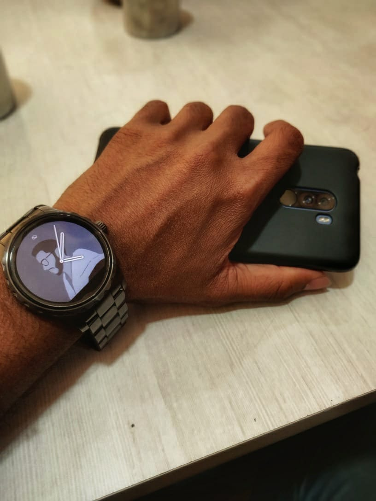
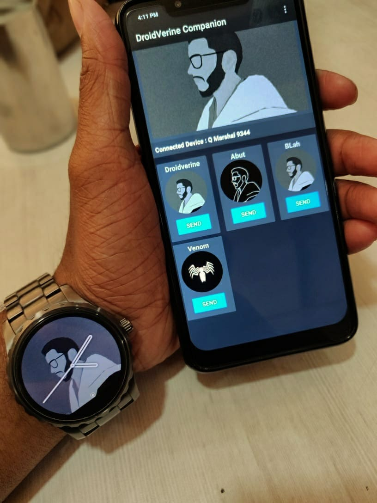

Android Wear watch face By DroidVerine
===============================
**Droidverine** is an app made for both Android Wearables and Smartphones. The app demonstrates how communications takes place betwenn Watch and mobile device.


 <p align=center>
    

</p>

## The Project contains following features:
```
  * Sending drawables from companion app to be set as watch face background.
  * Ambient mode enable/disable.
  * Always on Screen enable/disable.
  * Vibrate watch on data recived from companion app.
```


Images used in the project are subject to copyrights..
